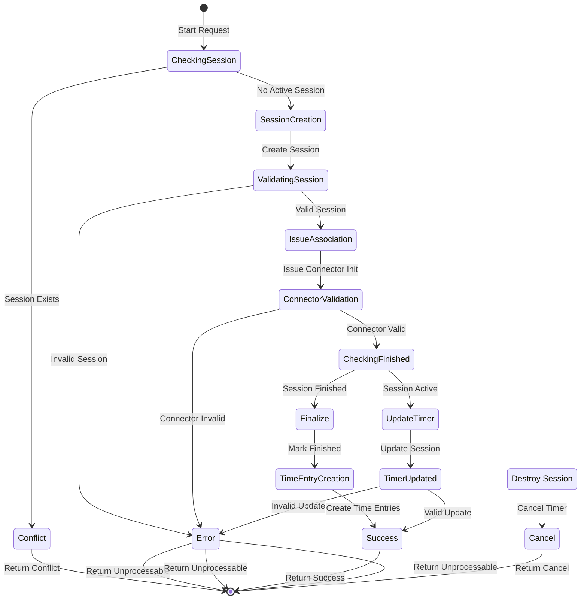

# Redmine-Tracky

Improved time tracking for Redmine (tested using Redmine 5.1)

## Prerequisites

- npm
- Bash [(>= 5.0)](https://www.gnu.org/software/bash/)
- MySQL or PostgreSQL [(>= 14)](https://www.postgresql.org/download/)
- Ruby [(= 3.1.2)](https://www.ruby-lang.org/en/downloads/)

## Development Setup

```sh
git clone -b 5.1-stable https://github.com/redmine/redmine
git clone https://github.com/renuo/redmine_tracky redmine/plugins/redmine_tracky
cd redmine/plugins/redmine_tracky

bin/setup
```

Optional: Adjust the [database file](../../config/database.yml)

## Production Setup

```sh
git clone https://github.com/renuo/redmine_tracky plugins/redmine_tracky

RAILS_ENV=production rake redmine:plugins:redmine_tracky:install
```

### Configuration

Administration => Roles & Permissions

### Development

- Run: `rake run`
- Lint: `rake lint`
- Test: `rake test`
- Watch Assets: `rake watch`

## Time Tracking Flow



## Copyright

Copyright 2021-2024 [Renuo AG](https://www.renuo.ch/), published under the MIT license.
